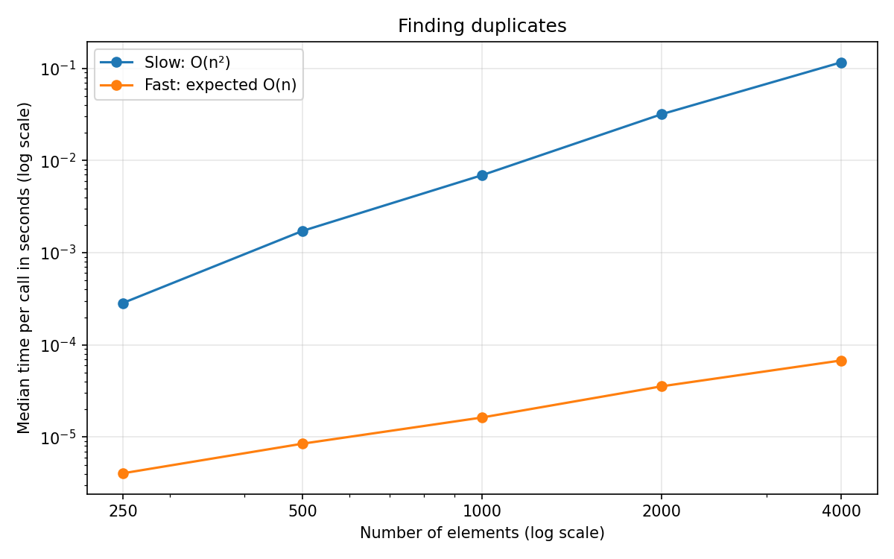

# CMPSC 202 - Midterm Programming Assignment

Name: Ritesh Ojha

**Instructions**: Complete the exercise below. Open book, open notes, any tools allowed (except submitting another student's work). Due tonight (10/6) at 11:59pm.

**Submission**: Fork this repository and invite your professor (username: bcmullins) to the repository. To submit, push your code to your forked repository. Make sure to include your name in the README file.

You have been provided with a starter Python file (`midterm_starter.py`). This file contains two fully implemented algorithms that solve the exact same problem: finding if an array contains duplicate values.

The file also contains a `flawed_benchmark()` function. The developer who wrote this benchmark made several severe methodological errors, making the printed timing results completely unreliable for comparing the asymptotic growth of these two algorithms.

**Your tasks**: 

1. Rewrite the `flawed_benchmark()` function to provide a robust empirical comparison of the two algorithms. List the methodological errors in the original benchmark and explain how you fixed them. Your benchmark should demonstrate the scaling behavior of the two algorithms across multiple input sizes.

I found these problems in the original benchmark:

- It timed the list creation along with the algorithm. I moved list creation outside the timer so only the duplicate check is measured.
- The algorithms used different random lists. I gave them the same list to make the comparison fair.
- The random lists could contain duplicates, letting the algorithms stop early. I used `list(range(n))`, which has no duplicates, so both have to finish their full search.
- It only tested 1,000 elements. I tested 250, 500, 1,000, 2,000, and 4,000 to see how the running time changes as the input grows.
- It only timed each algorithm once. I warmed up both functions, then used seven trials and took the median to reduce the effect of unusually slow runs. Each trial times several calls and divides by the number of calls. I used more calls for the fast algorithm because each call takes so little time.
- It used `time.time()`. I used `timeit`, which uses a timer designed for measuring elapsed time. I also switched which algorithm runs first on each trial.

I left both algorithms unchanged.

2. Run the empirical comparion and plot the results using a plotting library of your choice (e.g., `matplotlib`, `seaborn`, etc.). Include the plot in your submission called `results.png`. Be sure to label your axes and include a legend.

## How to run

```sh
python3 -m pip install -r requirements.txt
python3 midterm_starter.py
```

This prints the times and saves `results.csv` and `results.png`.

## Results



The slow algorithm gets much slower as the list grows because it checks every pair of elements. Doubling the input means roughly four times as many comparisons, which matches O(n²).

The fast algorithm goes through the list once and uses a set to track values. Its expected running time is O(n), so doubling the input should roughly double the time.

I used log scales so both lines are visible on the same graph. Actual timings vary between runs. These results are for lists without duplicates; a list with duplicates could let either algorithm finish early.
